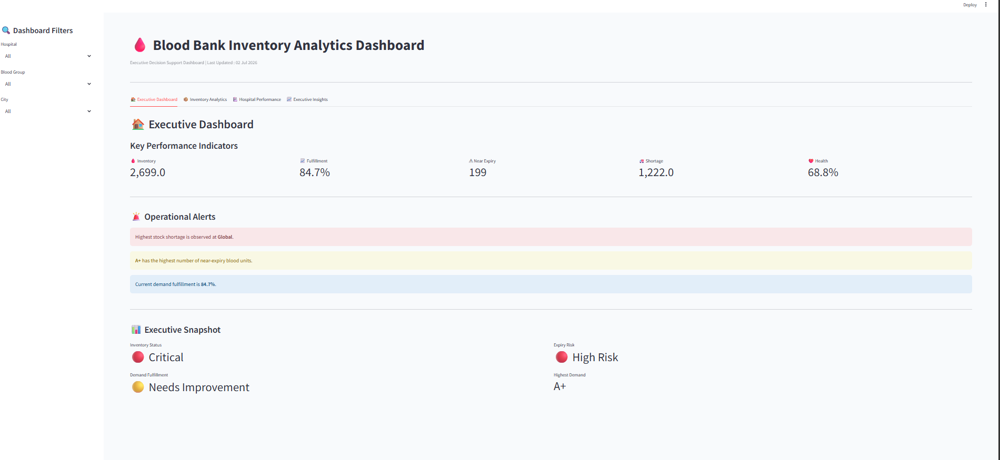
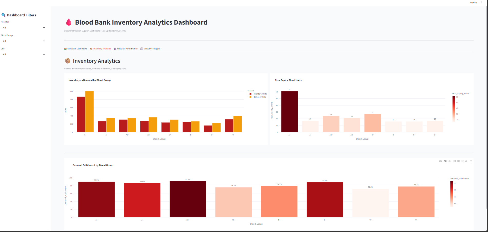
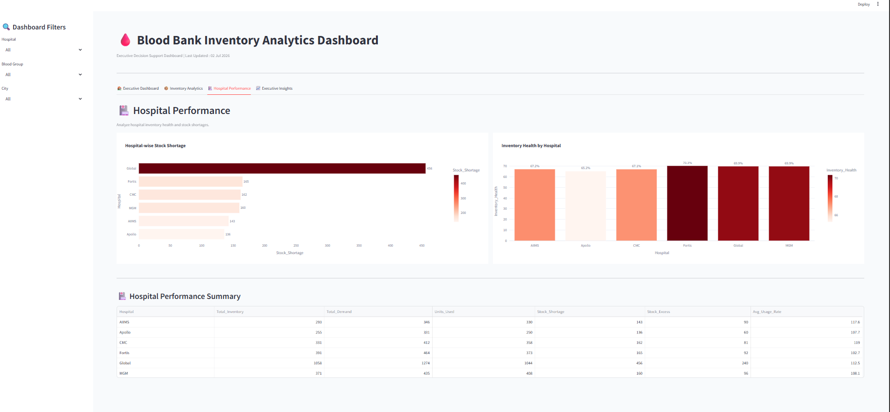
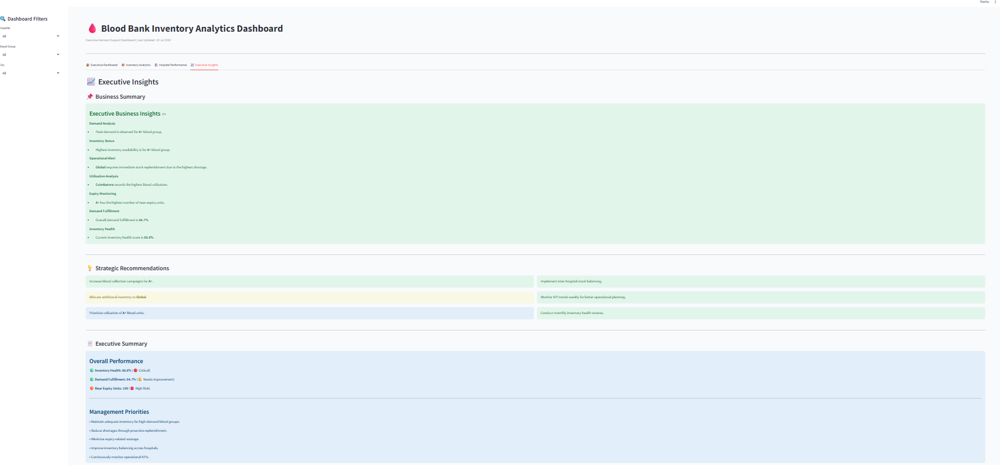

# Blood Bank Inventory Analytics Dashboard

## Overview

The Blood Bank Inventory Analytics Dashboard is a Business Intelligence solution developed using **Python**, **Streamlit**, **Pandas**, and **Plotly** to improve blood inventory management across healthcare organizations.

The dashboard provides real-time visibility into inventory availability, demand patterns, stock shortages, expiry risks, and hospital performance through interactive visualizations and executive-level metrics. It enables healthcare administrators to monitor operations, identify potential risks, and make informed inventory planning decisions.

---

## Business Problem

Blood banks face a critical challenge in maintaining the right inventory levels while minimizing wastage caused by expired blood units.

Common operational issues include:

- Blood shortages during emergencies
- Expired inventory resulting in wastage
- Uneven stock distribution across hospitals
- Limited visibility into inventory performance
- Reactive rather than proactive inventory planning

These challenges impact operational efficiency and the timely availability of blood for patients.

---

## Solution

This project delivers an interactive analytics dashboard that transforms operational blood bank data into meaningful business insights.

The dashboard enables stakeholders to:

- Monitor blood inventory across hospitals
- Compare inventory against demand
- Identify stock shortages
- Detect near-expiry blood units
- Evaluate inventory health
- Measure demand fulfillment
- Support strategic inventory planning

---

## Business Objectives

- Improve inventory visibility across hospitals.
- Reduce blood wastage through expiry monitoring.
- Identify high-demand blood groups.
- Detect hospitals with inventory shortages.
- Support proactive inventory planning.
- Enable data-driven operational decision-making.

---

## Dashboard Modules

### Executive Dashboard

Provides an executive overview of operational performance through:

- Key Performance Indicators (KPIs)
- Inventory Health
- Demand Fulfillment
- Operational Alerts
- Executive Snapshot

---

### Inventory Analytics

Analyzes inventory performance using:

- Inventory vs Demand by Blood Group
- Near Expiry Blood Units
- Demand Fulfillment Analysis

---

### Hospital Performance

Evaluates hospital operations through:

- Hospital-wise Stock Shortage
- Inventory Health by Hospital
- Hospital Performance Summary

---

### Executive Insights

Summarizes analytical findings including:

- Business Summary
- Strategic Recommendations
- Executive Performance Summary

---

## Key Performance Indicators

The dashboard monitors the following business metrics:

| KPI | Description |
|------|-------------|
| Total Inventory Units | Total blood units available |
| Demand Fulfillment (%) | Percentage of demand successfully fulfilled |
| Inventory Health (%) | Overall inventory efficiency |
| Stock Shortage | Units unavailable to meet demand |
| Near Expiry Units | Blood units expiring within seven days |

---

## Dashboard Preview

### Executive Dashboard



---

### Inventory Analytics


---

### Hospital Performance



---

### Executive Insights



---

## Business Insights

The dashboard helps answer critical operational questions, including:

- Which blood groups have the highest demand?
- Which hospitals experience the largest shortages?
- Which blood units are approaching expiry?
- How effectively is demand being fulfilled?
- Which hospitals maintain healthy inventory levels?
- Where should inventory be redistributed?

---

## Strategic Recommendations

Based on the analysis, the dashboard supports the following recommendations:

- Increase collection of high-demand blood groups.
- Redistribute inventory between hospitals to reduce shortages.
- Prioritize utilization of near-expiry blood units.
- Monitor inventory health regularly.
- Improve demand forecasting and replenishment planning.

---

## Technology Stack

| Technology | Purpose |
|------------|---------|
| Python | Data Processing |
| Pandas | Data Analysis |
| Plotly | Interactive Visualizations |
| Streamlit | Dashboard Development |

---

## Project Structure

```
Blood_Bank_Inventory_Analytics/
│
├── Dashboard/
│   └── app.py
│
├── Dataset/
│   └── Blood_Bank_Inventory_Feature_Engineered.csv
│
├── Images/
│   ├── executive_dashboard.png
│   ├── inventory_dashboard.png
│   ├── hospital_performance_dashboard.png
│   └── executive_insights_dashboard.png
│
├── Source/
│   ├── Data_Cleaning.ipynb
│   ├── Exploratory_Data_Analysis.ipynb
│   └── Feature_Engineering.ipynb
│
├── requirements.txt
├── README.md
└── .gitignore
```

---

## Installation

Clone the repository:

```bash
git clone https://github.com/yourusername/Blood_Bank_Inventory_Analytics.git
```

Navigate to the project directory:

```bash
cd Blood_Bank_Inventory_Analytics
```

Install dependencies:

```bash
pip install -r requirements.txt
```

Run the application:

```bash
streamlit run Dashboard/app.py
```

---

## Future Enhancements

- Machine Learning-based demand forecasting
- Real-time inventory integration
- Automated shortage notifications
- Predictive expiry analysis
- Cloud deployment
- Role-based access control

---

## Business Value

The dashboard enables healthcare organizations to improve inventory visibility, reduce blood wastage, prevent shortages, and support data-driven decision-making through an interactive Business Intelligence solution.

---

## Author

**Ramapriya M**

Aspiring Data Analyst | Python | SQL | Power BI | Excel | Streamlit